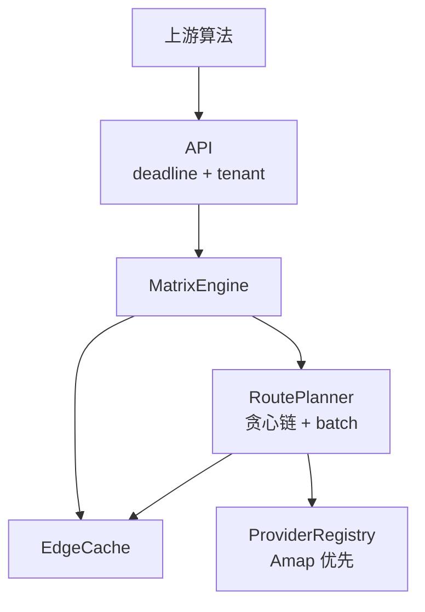

# Enterprise Distance Matrix Service — Design Spec v2

**Date:** 2026-07-15  
**Status:** Revised (v2)  
**Approach:** Scheme 2 — Core engine rewrite; Go HTTP as thin shell  
**Lineage:** Absorbed Python `amap_distance_matrix` pilot (removed); edge cache + chain amortization in Go `internal/`.

### v2 变更摘要（相对 v1）

| 采纳 | 不采纳（ROI 低 / 过度设计） |
|------|---------------------------|
| 缓存键 **tenant + method + strategy** 隔离 | 请求/响应 `{id, lon, lat}` |
| Redis 读路径 **HGET/HMGET，禁 HSCAN 热路径** | `confidence` / `quality` / 响应 `meta` 块 |
| **多租户** Header + key 前缀 | Batch Matrix API、Cache warming |
| **Capacity Planning** | 动态 geo_wide、Provider cost router、MySQL 热读 |
| 内部 metrics/logs 观测降级与缓存 | Clarke-Wright 链优化（留接口） |

---

## 1. 定位

为上游 VRP / 调度 / 优化算法提供 **同步 OD 距离/时间矩阵**。

核心策略（继承 Python）：

> **缓存边（edge），不缓存整张矩阵。** 链式摊薄 Provider 调用；Redis 模糊命中；失败降级（haversine×1.5），**观测走 metrics/logs，不膨胀 API 响应**。

服务是 **近似、缓存优先** 的矩阵引擎，不是 ground-truth 导航。

**调用模型：** 同步 HTTP，超时报错；上游在时间窗内重试；**分段写穿 Redis**，重试越来越快。

---

## 2. 架构



| 包 | 职责 |
|----|------|
| `internal/handler` | HTTP、校验、tenant 解析、deadline |
| `internal/engine` | 矩阵编排、填表 |
| `internal/cache` | Redis GEO + HASH + ZSET 索引 |
| `internal/planner` | 边链排序、batch、并发 Provider |
| `internal/provider` | Amap 实现 + 接口预留 |

旧 `sdk/`、`common/`、`internal/logic/` 已移除；坐标工具在 `internal/geo`。

---

## 3. API（极简）

### `POST /v1/matrix`

**请求**

```json
{
  "points": [[116.40, 39.90], [116.41, 39.91]],
  "coordinate": "gcj02",
  "strategy": 0,
  "method": 0,
  "timeslot": "",
  "strict": false,
  "geo_wide_m": 200,
  "provider": "amap"
}
```

**Header**

```
X-Tenant-Id: sf-express    # 缺省 default
```

**成功响应** — 只返回矩阵，无 `meta`、无 `confidence`：

```json
{
  "code": 200,
  "msg": "OK",
  "data": {
    "distances": [[0, 1200], [1180, 0]],
    "durations": [[0, 180], [175, 0]]
  }
}
```

**超时**

```json
{
  "code": 504,
  "msg": "MATRIX_DEADLINE"
}
```

504 前已写穿的边留在 Redis，上游重试即可加速。是否在重试前等待，由上游自行决定。

### 其他端点

| 路径 | 说明 |
|------|------|
| `POST /v1/route` | 多点途经（次要） |
| `GET /v1/providers` | Provider 列表 |
| `GET /health/ready` | Redis + Provider 就绪 |

---

## 4. MatrixEngine

流程：

1. 坐标归一化 → 去重 → 全有向边
2. `edge_get` 批量查缓存
3. miss 边：贪心链排序 → RoutePlanner 分批 Provider → **段成功即写 Redis**
4. 填 `distances` / `durations`（对角 0；链上段；strict=false 可反向复用；仍缺则单段补查；再缺则 haversine×1.5）
5. deadline 未到则 200；否则 504

### strict 模式

| | strict=false | strict=true |
|--|--------------|-------------|
| 空间模糊 | geo_wide | 精确 geohash 对优先 |
| 时间 | 小时桶；近距可 HMGET ±1h | 仅当前 `w_m_h` field |
| 反向复用 | 允许 | 禁止 |

引擎内部可标记边 `source`（cache/provider/chain/fallback）供 **日志与 metrics**，**不出现在 HTTP body**。

---

## 5. EdgeCache（v2 核心修正）

### 5.1 问题

v1：`HASH edge:{b}:{e}` + field=`w_m_h` → method/strategy 未隔离；HSCAN 在大 Hash 上慢。

### 5.2 键结构

```
tenant   = X-Tenant-Id（默认 default）
ctx      = {method}:{strategy}
slot     = w_m_h                   # 如 4070714（Python time_slot_wmh）

GEO   {tenant}:geo
HASH  {tenant}:edge:{method}:{strategy}:{b_geohash}:{e_geohash}
      field = {slot}
      value = EdgeJSON（distance_m, duration_s, polyline, computed_at, provider）
ZSET  {tenant}:edge_keys          # 运维/GC，不在热路径
```

### 5.3 读路径

```
GEO GEORADIUS → 候选 key（含反向）
strict:     HGET key slot
fuzzy:      HGET slot；miss 则 HMGET ±1h（最多 3 field）
miss:       走 Provider
```

禁止 open-ended `HSCAN match *`。

### 5.4 写路径

每段 Provider 成功 → pipeline：`GEOADD + HSET + EXPIRE(14d) + ZADD`。

---

## 6. RoutePlanner

MVP：Python 贪心链 `point_pairing_sorted`，batch=12，errgroup 并发。

预留接口，不实现高级算法：

```go
type ChainOptimizer interface {
    Order(edges [][2]float32) [][2]float32
}
```

---

## 7. Provider

```go
type Provider interface {
    Name() string
    Route(ctx context.Context, req RouteRequest) (*RouteResult, error)
}
```

Amap MVP：GET + `key=`、多 key 池（见 [Key pool scheduler](../key-pool-algorithm.md)）、2s 超时。失败由 engine 填 haversine 降级。

---

## 8. 多租户

| 项 | 做法 |
|----|------|
| 隔离 | Redis `{tenant}:` 前缀 |
| 传入 | `X-Tenant-Id` |
| 限流 | 每 tenant QPS |

---

## 9. 同步 + 重试

幂等键：`tenant + points + method + strategy + timeslot + strict`。写穿 + 上游重试；建议重试间隔 ≥500ms。

---

## 10. 观测（仅内部，不进 API）

**Metrics**

- `matrix_requests_total{tenant,status}`
- `matrix_cache_hit_ratio`
- `matrix_fallback_edges_total`
- `matrix_provider_calls_total`
- `matrix_deadline_exceeded_total`
- `matrix_request_duration_seconds`

**Logs（结构化）**

`request_id`, `tenant`, `n_points`, `cache_hit_ratio`, `fallback_edges`, `provider_calls`, `elapsed_ms`

降级、缓存命中、Provider 调用次数 **只在这里体现**，不返回给算法消费者。

---

## 11. Capacity Planning（简版）

100 QPS × 50 点 × 80% cache hit → 约 **7,500 Provider QPS**（需压测）。

默认限流：单 tenant 50 QPS；单请求 max 100 points。

---

## 12. 实施阶段

| 阶段 | 交付 |
|------|------|
| **P0** | EdgeCache v2 + tenant + miniredis 测试 |
| **P1** | AmapProvider + RoutePlanner |
| **P2** | MatrixEngine + `/v1/matrix`（distances/durations only） |
| **P3** | 写穿、504、metrics、限流 |
| **P4** | 旧 API 兼容；下线 sdk.Matrix |

---

## 13. 测试

- 键隔离：car/truck 不互读
- strict：禁止反向复用
- 504 后重试命中已写边
- 无 panic/hang
- 压测 Provider QPS

---

## 14. 风险

| 风险 | 缓解 |
|------|------|
| fallback 误导优化器 | 文档说明近似语义；metrics 监控 fallback 比例 |
| 缓存污染 | method/strategy 进 key |
| Provider 配额 | 压测 + 限流 |
| 链式 ≠ 真 OD | 文档 + strict 模式 |

---

## 15. References

- Go: `internal/engine`, `internal/cache`, `internal/loadbalance`
- [Key pool scheduler](../key-pool-algorithm.md)
- [Completion plan](./completion-plan.md)

---

## Approval

- **v1:** Scheme 2 — 2026-07-15  
- **v2:** 2026-07-15 — 缓存/租户/Redis 生产化；**API 保持 distances + durations 两矩阵**

### 设计原则（v2）

1. **API 极简** — 算法只要距离和时间；质量与运维信息走 metrics/logs。
2. **缓存键带上下文** — tenant / method / strategy 隔离。
3. **Redis 热路径不用 HSCAN**。
4. **写穿支撑同步重试** — 504 不是白算。
5. **容量可算** — 上线前压测 Provider 配额。
