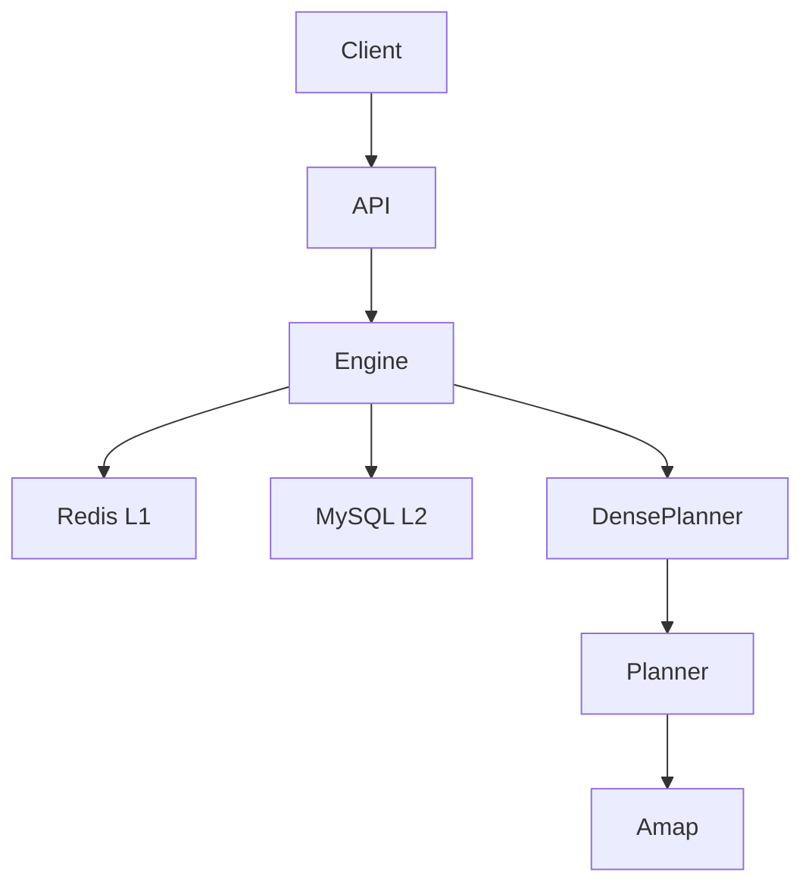

# Enterprise Distance Matrix Service

**Status:** Active · **Updated:** 2026-07-17

## Scope

| In | Out |
|----|-----|
| Redis edge cache + optional MySQL L2 | MySQL on hot path |
| tenant / method / strategy isolation | Response `meta` / confidence |
| Dense miss planner + provider batch | Batch/async matrix API |
| ADCS multi-key pool | Cache warming, cost router |
| Metrics/logs for degrade | — |

## 1. Positioning

Synchronous OD distance/duration matrix service: cache edges, not full matrices; Redis hot path; optional MySQL cold store; Dense planner amortizes provider calls; fallback haversine×1.5; observability via metrics/logs.

Synchronous HTTP with write-through; timeout → 504; upstream retries reuse edges already written.

## 2. Architecture



| Package | Role |
|---------|------|
| `handler` | HTTP, tenant, deadline |
| `engine` | Matrix orchestration |
| `cache` / `persist` | Redis L1 / MySQL L2 |
| `arccover` | Dense miss planner |
| `planner` | Provider batch |
| `provider` / `loadbalance` | Amap + key pool |

## 3. API

`POST /v1/matrix` — body: points, coordinate, strategy, method, timeslot, strict, geo_wide_m, provider.  
Header: `X-Tenant-Id`.  
Response: `{distances, durations}` only. Timeout: `504 MATRIX_DEADLINE`.

Also: `/v1/route`, `/v1/providers`, `/health/*`.

## 4. Engine flow

1. GCJ-02  
2. Probe Redis → optional MySQL L2 (promote on hit)  
3. DensePlanner on misses → batch Provider → write-through  
4. Fill matrix (reverse if non-strict; else pair / haversine)  

| | strict=false | strict=true |
|--|--------------|-------------|
| Spatial | geo_wide | exact geohash |
| Time | ±1h | exact WMH |
| Reverse | allow | forbid |

## 5. Edge storage

```
HASH {tenant}:edge:{method}:{strategy}:{b}:{e}  field=WMH
GEO  {tenant}:geo
```

Read: Redis → MySQL L2 (if DSN) → Provider. No HSCAN on hot path.  
Write: Redis pipeline; async MySQL upsert. DDL: `scripts/ddl/`.

## 6. Planner / Provider

- DensePlanner plans walks ≤ L legs  
- RoutePlanner executes batches (default 12 waypoints)  
- Amap multi-key ADCS — see [key-pool-algorithm](../key-pool-algorithm.md)  
- Fallback haversine × 1.5 (provider hardcoded)

## 7. Multi-tenant & retry

Redis/MySQL keyed by tenant. Per-tenant QPS. Idempotent retry ≥500ms after 504.

## 8. Observability (internal only)

Actual metrics: `matrix_api_requests_total`, `matrix_api_request_duration_ms`, `matrix_engine_fallback_edges_total`, `matrix_engine_provider_calls_total`.

Logs: tenant, n, cache_hit, fallback, provider_calls, elapsed_ms.

## 9. Capacity

`Provider QPS ≈ client_qps × points × (1 - hit_ratio)`. Defaults: TenantQPS 50, MaxPoints 100.

## 10. Risks

| Risk | Mitigation |
|------|------------|
| Fallback misleads optimizer | Docs + metrics |
| Cache pollution | method/strategy in key |
| Provider quota | Load test + limit |
| Planned walk ≠ true OD | Document + strict mode |

## References

[Architecture](../architecture.md) · [Key pool](../key-pool-algorithm.md) · [Dense](./hybrid-arc-cover-algorithm.md) · `scripts/ddl/`
